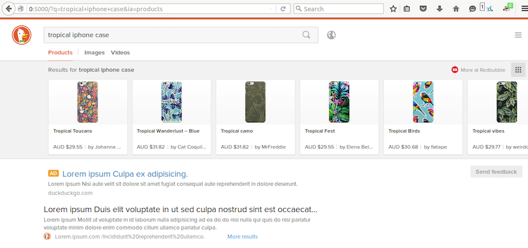

# Redbubble Instant Answer

> **Note**: This `README` is specific to the [Redbubble Instant Answer][redbubble-ia]. Please see [the original README][original] more information about DuckDuckGo Instant Answers.

  [redbubble-ia]: https://duck.co/ia/view/redbubble
  [original]: ./ORIGINAL_README.md
  [rb]: http://www.redbubble.com

Overview
--------

### Description

Search for available products by independent artists.

### Data Source

The [Redbubble][rb] search API.

### Example Queries

`jellyfish duvet cover`, `flower pencil-skirts`, `flowers t-shirt`, `tropical iphone case`, `rainbow art prints`, `tatoo stickers`, `colorful greeting-cards`

### Triggers

All the Redbubble product names do trigger the <abbr title="Instant Answer">IA</abbr>, both in their singluar and plural forms. But queries containing only a product name are discarded.

Development
-----------

Please refer to the [Development section][contribute] of the original `README` for details about how to setup your development environment, test instant answers, and find the relevant sections of the documentation.

  [contribute]: ./ORIGINAL_README.md#improve-a-live-instant-answer

